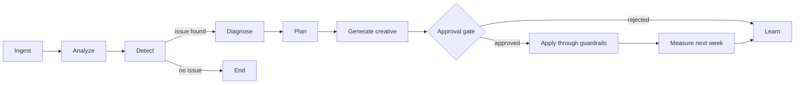

# Agent workflow

The approval gate pauses a high-risk proposal before the connector write. The API retains the workflow state while a person reviews the evidence, generated creative, confidence, and spend effect. Approval resumes the same action; rejection records the decision and ends without changing the simulated platform.
